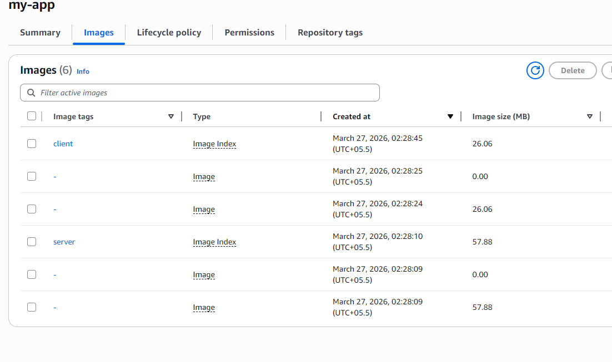

# AWS Elastic Container Registry (ECR) Deployment Guide

This document outlines the professional workflow for tagging and pushing containerized images to Amazon ECR. 

---

## 🏗️ Deployment Workflow Overview

To deploy your MERN stack to AWS, you must synchronize your local Docker images with your remote ECR repository. This guide assumes you are pushing multiple services (Server and Client) into a single unified repository using distinct image tags.

---

## 📋 1. Prerequisites

Before initiating the push, ensure you meet the following requirements:

1.  **AWS CLI Configured**: Your local machine must have the AWS CLI installed and configured with appropriate IAM permissions (e.g., `AmazonEC2ContainerRegistryFullAccess`).
2.  **Docker Daemon Running**: Ensure Docker Desktop is active.
3.  **ECR Authentication**: Generate a temporary login token and authenticate your Docker client:

```powershell
aws ecr get-login-password --region <REGION> | docker login --username AWS --password-stdin <AWS_ACCOUNT_ID>.dkr.ecr.<REGION>.amazonaws.com
```

---

## 🏷️ 2. Image Tagging Strategy

We use a **Distinct Tagging Strategy** to allow multiple services to coexist within the same repository (`my-app`).

| Service | Local Image | Target ECR Tag |
| :--- | :--- | :--- |
| **Express Server** | `dockerized-mern-app-server:latest` | `<AWS_ACCOUNT_ID>.dkr.ecr.<REGION>.amazonaws.com/my-app:server` |
| **React Client** | `dockerized-mern-app-client:latest` | `<AWS_ACCOUNT_ID>.dkr.ecr.<REGION>.amazonaws.com/my-app:client` |

---

## 🚀 3. Push Instructions

Execute the following commands in your terminal to tag and upload your images.

### A. Deploy Server Image
```powershell
# Tagging
docker tag dockerized-mern-app-server:latest <AWS_ACCOUNT_ID>.dkr.ecr.<REGION>.amazonaws.com/my-app:server

# Pushing
docker push <AWS_ACCOUNT_ID>.dkr.ecr.<REGION>.amazonaws.com/my-app:server
```

### B. Deploy Client Image
```powershell
# Tagging
docker tag dockerized-mern-app-client:latest <AWS_ACCOUNT_ID>.dkr.ecr.<REGION>.amazonaws.com/my-app:client

# Pushing
docker push <AWS_ACCOUNT_ID>.dkr.ecr.<REGION>.amazonaws.com/my-app:client
```

---

## ✅ 4. Final Verification

Once the push is complete, verify the presence of your images in the AWS Console. Your repository should look like the following:



---

## 🛠️ 5. Common Troubleshooting

| Issue | Potential Cause | Resolution |
| :--- | :--- | :--- |
| `No such image` | The image has not been built locally yet. | Run `docker-compose build` first. |
| `EOF` or `Retrying` | The authentication token has expired. | Re-run the ECR Login command (Step 1). |
| `Repository not found` | The ECR repository name is misspelled. | Confirm the repository name in the AWS Console. |

---

> [!IMPORTANT]  
> **Security Note**: This guide uses `<AWS_ACCOUNT_ID>` and `<REGION>` as placeholders. For your local use, replace these with your actual 12-digit AWS ID and region (e.g., `ap-southeast-2`).
