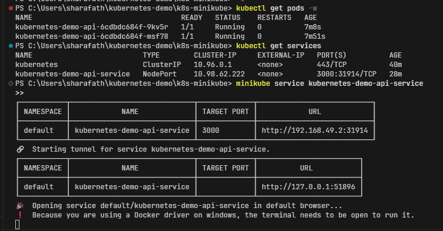

# Pushing Docker Image to Docker Hub

Before deploying the application to Kubernetes, the first step is to build the Docker image and push it to a container registry like Docker Hub so that Kubernetes can pull it.

## Prerequisites

- You need a Docker Hub account. If you don't have one, create it at [hub.docker.com](https://hub.docker.com/).
- Docker must be installed and running on your local machine.

## Steps

### 1. Log in to Docker Hub
Open your terminal and run the following command to authenticate with Docker Hub:
```bash
docker login
```
Enter your Docker Hub username and password when prompted.

### 2. Build or Tag the Docker Image

**Scenario A: Building a new image**
Build the Docker image from your `Dockerfile`. Make sure to tag it with your Docker Hub username, the repository name, and an optional version tag (like `latest` or `1.0.0`).

```bash
docker build -t <your-dockerhub-username>/k8s-minikube-demo:latest .
```

**Scenario B: If the image is already created (without proper tagging)**
If you have already built an image locally using a generic build command like `docker build -t k8s-minikube-demo:latest .` without your Docker Hub username, you will need to apply a new tag to the existing image so that Docker knows where to push it:

```bash
docker tag k8s-minikube-demo:latest <your-dockerhub-username>/k8s-minikube-demo:latest
```

*Note: Replace `<your-dockerhub-username>` with your actual Docker Hub username.*

### 3. Push the Image to Docker Hub
Once the image is built successfully, push it to Docker Hub using the `docker push` command:

```bash
docker push <your-dockerhub-username>/k8s-minikube-demo:latest
```

After these steps are complete, your image is securely stored in Docker Hub and can be used in your Kubernetes manifests to run the application in your Minikube cluster.

## Understanding Kubernetes Manifests

In the `k8s/` directory, there are two critical files used to run your application in Kubernetes: `deployment.yaml` and `service.yaml`.

### 1. `deployment.yaml` (The "What" and "How Many")
A **Deployment** is responsible for keeping a set of identical pods (your containers) running and updating them in a controlled way. 
- **Replicas:** It ensures that a specified number of application instances are running at all times (e.g., `replicas: 2`). If a pod crashes, the Deployment immediately starts a new one to replace it (self-healing).
- **Updates:** It allows you to seamlessly update your application to a new version without downtime (Rolling Updates).
- **Configuration:** It defines exactly what image to run, what ports to open, what resource limits to apply, and defines probes to check if the app is healthy.

### 2. `service.yaml` (The "How to Connect")
Pods matching a Deployment are ephemeral; they can be destroyed and created constantly, meaning their internal IP addresses are always changing. A **Service** provides a stable networking endpoint to solve this problem.
- **Stable IP/DNS:** It gives your application a single, unchanging IP address and DNS name inside the cluster.
- **Load Balancing:** It automatically spreads incoming network traffic across all the healthy replicas defined in your Deployment.
- **Exposure:** By using a `type: NodePort` (or `LoadBalancer`), the Service allows external traffic (like your local browser) to access the application running inside the isolated Kubernetes cluster.


## Starting Your Local Cluster

Before applying your Kubernetes configuration files, you need to start your local Minikube cluster.

### 1. `minikube start`
This command initializes and starts a local single-node Kubernetes cluster. It sets up a virtual machine (or uses Docker containers) on your machine that runs all the necessary Kubernetes control plane components.

```bash
minikube start
```

### 2. `kubectl get nodes`
After Minikube is running, you can use `kubectl` (the command-line tool for interacting with the Kubernetes API) to verify the status of your cluster. This command lists the active nodes in your cluster. With Minikube, you should see exactly one node named `minikube` with a `Ready` status.

```bash
kubectl get nodes
```

### 3. `kubectl cluster-info`
To view the URLs for the Kubernetes control plane and core services (like CoreDNS), run this command. It's useful for verifying that the API server is responding correctly and to check exactly where your cluster components are hosted.

```bash
kubectl cluster-info
```

## Applying Your Configuration

Once your cluster is running and your manifest files are created, it's time to apply them to the cluster.

### 1. Apply the Manifests

You have two options for applying your configuration files:

**Option A: Apply all at once (Recommended)**
You can pass the entire directory to `kubectl apply`. This tells Kubernetes to read all `.yaml` files inside the `k8s/` directory and apply them simultaneously, creating both your Deployment and Service in one swoop.
```bash
kubectl apply -f k8s/
```

**Option B: Apply separately**
Alternatively, you can apply each file individually if you want to test them step-by-step.
```bash
# Apply the deployment first
kubectl apply -f k8s/deployment.yaml

# Then apply the service
kubectl apply -f k8s/service.yaml
```

### 2. Verify Your Resources
You can check the status of your newly created pods and services using these commands:
```bash
# Check if pods are running
kubectl get pods -w
```
*You should see output similar to this as your replicas spin up:*


```bash
# Check if the service was created
kubectl get services
```

### 3. Access the Application
Because Minikube runs inside a virtual environment (or container), a `NodePort` service isn't immediately accessible on `localhost`. Minikube provides a built-in command to tunnel the service and open it in your browser:
```bash
minikube service kubernetes-demo-api-service
```
This will automatically map the cluster port to your local machine and open the application in your default web browser.

*You should see your API successfully running in the browser!*


## 4. Automation (Optional)

If you prefer to deploy everything with a single command instead of running the steps manually, you can use the included bash script!

The script will automatically start Minikube, apply the Kubernetes configurations from the `k8s/` folder, wait for your pods to be ready, and then automatically launch the application in your browser.

To run the complete automated deployment, simply use the npm script we set up:
```bash
npm run deploy
```

## 5. Clean Up (Stopping the Cluster)

Because Minikube runs a virtual machine (or Docker containers) in the background, it consumes CPU and Memory. When you are done testing your application, you should stop the cluster to free up your system resources.

To stop Minikube safely, run:
```bash
minikube stop
```
*(Note: This does not delete your data or configurations. Next time you run `minikube start`, your cluster will pause right back where you left it!)*

---

### Troubleshooting: `connection refused` Error

If you attempt to run `minikube start` after previously stopping the cluster and encounter a `failed to download openapi` or `connection refused` error on port `8443`, your Minikube networking or certificates may have become desynced.

The easiest way to fix this in local development is to completely delete the old cluster and start fresh:
```bash
minikube delete
```
After running this, you can simply run `npm run deploy` to instantly recreate the cluster and redeploy everything automatically!